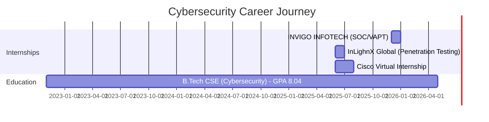

<p align="left">
  <a href="https://github.com/Aayush-Raj-Singh">
    
  </a>
  
  
</p>

# 🛡️ Hey, I'm Aayush Raj — Cybersecurity Engineer & Threat Hunter

<table style="width: 100%;">
  <tr>
    <td width="65%">
      <p>
        My journey into cybersecurity started with curiosity—figuring out how systems work, and more importantly, <strong>how they break</strong>. That spark evolved into a mission to build smarter, stronger, and more secure technology.
      </p>
      <p>
        As a <strong>Cybersecurity Engineer</strong> specializing in <strong>VAPT, SOC operations, and threat intelligence</strong>, I've identified <strong>40+ security misconfigurations</strong> across enterprise systems and validated <strong>25+ exploitable attack vectors</strong> through penetration testing.
      </p>
      <p>
        I build <strong>AI-powered security tools</strong> that process <strong>1,000+ threat indicators</strong> daily, reducing manual assessment effort by <strong>60%</strong> and threat awareness latency by <strong>70%</strong>.
      </p>
    </td>
    <td width="35%" align="center">
      
    </td>
  </tr>
</table>

---

## 📈 Impact at a Glance

<div align="center">

| 🎯 Metric | 📊 Achievement |
|:---|:---:|
| **Security Vulnerabilities Identified** | 40+ critical misconfigurations |
| **Attack Vectors Validated** | 25+ exploitable paths |
| **Threat Indicators Processed** | 1,000+ daily via ML pipeline |
| **Manual Assessment Reduction** | ↓ 60% effort saved |
| **Threat Awareness Improvement** | ↓ 70% latency reduction |
| **CVE Components Scanned** | 50+ system components |
| **Training Hours Completed** | 100+ enterprise-grade |

</div>

---

## 🚀 Current Focus

```python
class AayushRaj:
    def __init__(self):
        self.role = "Cybersecurity Engineer"
        self.specialization = ["VAPT", "SOC Operations", "Threat Intelligence"]
        self.current_work = "Building AI-powered threat detection systems"
        self.learning = ["Advanced Red Teaming", "DFIR", "Security Architecture"]
        self.tech_stack = {
            "security": ["Burp Suite", "Metasploit", "Nmap", "Wireshark"],
            "automation": ["Python", "Bash", "AI/ML"],
            "frameworks": ["MITRE ATT&CK", "OWASP Top 10"],
            "cloud": ["AWS IAM", "Azure Security"]
        }
    
    def say_hi(self):
        print("Let's build a more secure digital future together!")

me = AayushRaj()
me.say_hi()
```

---

## 🛠️ Tech Arsenal & Proficiency

### 🔒 Cybersecurity & Penetration Testing

<p align="left">
  
  
  
  
  
  
  
</p>

**Skill Proficiency:**
```text
VAPT (Vulnerability Assessment & Penetration Testing)  ████████████████░░ 90%
Threat Intelligence & Analysis                         ██████████████████ 95%
Network Defense & Monitoring                           ████████████████░░ 85%
SIEM & SOC Operations                                  ███████████████░░░ 80%
Incident Response & DFIR                               ██████████████░░░░ 75%
```

### 💻 Programming & Automation

<p align="left">
  
  
  
  
</p>

**Language Proficiency:**
```text
Python (Security Scripting & Automation)               ██████████████████ 90%
Bash Scripting (Linux Security Tools)                  ████████████████░░ 85%
SQL (Database Security & Analysis)                     ███████████░░░░░░░ 60%
PowerShell (Windows Security Automation)               ██████████░░░░░░░░ 55%
```

### 🧠 AI/ML for Security

<p align="left">
  
  
  
  
</p>

### 🌐 Networking & Infrastructure

<p align="left">
  
  
  
  
</p>

**Network Security Expertise:**
```text
TCP/IP Protocol Analysis                               ██████████████████ 90%
Routing & Switching (CCNA Level)                       ████████████████░░ 85%
Network Traffic Analysis (Wireshark)                   ████████████████░░ 85%
Infrastructure Hardening                               ███████████████░░░ 80%
```

### ☁️ Cloud Security & DevSecOps

<p align="left">
  
  
  
  
</p>

---

## 📊 GitHub Analytics

<p align="center">
  
  
</p>

<p align="center">
  
  
</p>

---

## 🏆 Featured Security Projects

### 🔍 Agent-less Windows System Vulnerability Scanner
[](https://github.com/Aayush-Raj-Singh/windows-vulnerability-scanner)
[](https://www.python.org/)
[](https://cve.mitre.org/)

```yaml
Description: Enterprise-grade Windows vulnerability assessment tool
Technology: Python, Network Analysis, CVE Database Integration
Impact:
  - ✅ Scans 50+ system components without endpoint installation
  - ✅ Automated CVE-based flaw discovery and exploit correlation
  - ✅ Reduces manual assessment effort by ~60%
  - ✅ Generates risk-scored reports with remediation guidance

Key Features:
  • Agent-less architecture for zero-footprint scanning
  • Real-time CVE database correlation
  • Comprehensive risk scoring and prioritization
  • Compliance alignment reporting (NIST, CIS)
```

### 🧠 Cyber Threat Intelligence AI System
[](https://github.com/Aayush-Raj-Singh/threat-intel-ai)
[](https://www.tensorflow.org/)
[](https://github.com/)

```yaml
Description: ML-powered threat intelligence platform for Indian cyberspace
Technology: Python, Machine Learning, Web Scraping, NLP
Impact:
  - ✅ Processes 1,000+ threat indicators daily
  - ✅ Real-time dark web and paste site monitoring
  - ✅ Reduces threat awareness latency by ~70%
  - ✅ Delivers actionable intelligence for CII protection

Key Features:
  • Multi-source data aggregation (dark web, social platforms)
  • ML-based threat correlation engine
  • Near real-time incident tracking
  • Geographically focused on Indian cyber landscape
```

### 🔐 Cryptographic Algorithm Identifier
[](https://github.com/Aayush-Raj-Singh/crypto-identifier)
[](https://scikit-learn.org/)

```yaml
Description: ML classifier for identifying encryption algorithms from ciphertext
Technology: Python, scikit-learn, Statistical Analysis
Impact:
  - ✅ High accuracy across multiple modern encryption methods
  - ✅ Pattern recognition for cryptanalysis support
  - ✅ Automated algorithm fingerprinting

Key Features:
  • Statistical feature extraction from encrypted datasets
  • Multi-algorithm classification (AES, RSA, DES, etc.)
  • Pattern recognition for cryptographic signatures
```

### 📡 OEM Vulnerability Monitoring Tool
[](https://github.com/Aayush-Raj-Singh/oem-vuln-monitor)
[](https://github.com/)

```yaml
Description: Automated patch tracking for IT/OT equipment security advisories
Technology: Python, Web Scraping, Alert Systems
Impact:
  - ✅ Monitors 10+ OEM security portals continuously
  - ✅ Real-time alerting for critical vulnerabilities
  - ✅ Reduces threat awareness latency by ~70%

Key Features:
  • Multi-vendor advisory aggregation
  • Severity-based alerting (Critical/High priority)
  • Automated patch availability tracking
```

---

## 💼 Professional Experience Timeline



**Key Achievements:**
- 🎯 **INVIGO INFOTECH** - Conducted risk assessments across 15+ client systems, identified 40+ critical misconfigurations
- 🎯 **InLighnX Global** - Validated 25+ exploitable attack vectors using MITRE ATT&CK methodology
- 🎯 **Cisco Virtual** - Completed 100+ hours of enterprise security training

---

## 🎓 Certifications & Badges

<details>
<summary><b>🔐 Cybersecurity Certifications (Click to expand)</b></summary>
<br/>

<div align="center">

### EC-Council


### Cisco Networking Academy
<p>
  
  
  
  
</p>

### TryHackMe
<p>
  
  
  
  
</p>

</div>

</details>

---

## 📚 Learning Roadmap 2026

```text
Q1 2026  ████████████████████ 100% ✅ EHE, CCNA Enterprise, SOC Fundamentals
Q2 2026  ██████████░░░░░░░░░░  50% 🔄 CEH Practical, Security+, Advanced Python
Q3 2026  ░░░░░░░░░░░░░░░░░░░░   0% 📅 OSCP Prep, Cloud Security (AWS/Azure)
Q4 2026  ░░░░░░░░░░░░░░░░░░░░   0% 📅 GIAC Certifications, Malware Analysis
```

**Current Focus Areas:**
- 🎯 Offensive Security Certified Professional (OSCP)
- 🎯 Certified Ethical Hacker (CEH) Practical
- 🎯 AWS Certified Security - Specialty
- 🎯 GIAC Security Essentials (GSEC)

---

## 🤝 Let's Collaborate!

I'm actively seeking opportunities in:

<table>
<tr>
<td width="50%">

### 🔐 Security Roles
- **SOC Analyst** positions
- **Penetration Testing** engagements
- **Threat Intelligence** roles
- **Security Engineering** internships

</td>
<td width="50%">

### 🛠️ Open Source
- **Security tool development**
- **Vulnerability research**
- **CTF collaborations**
- **Knowledge sharing** & mentorship

</td>
</tr>
</table>

---

## 📫 Connect With Me

<p align="center">
  <a href="https://linkedin.com/in/Aayush-Raj" target="_blank">
    
  </a>
  <a href="mailto:aayush.raj@myyahoo.com">
    
  </a>
  <a href="https://github.com/Aayush-Raj-Singh" target="_blank">
    
  </a>
  <a href="https://aayush-raj-singh.github.io/Portfolio" target="_blank">
    
  </a>
  <a href="https://tryhackme.com/p/AayushRaj" target="_blank">
    
  </a>
</p>

<p align="center">
  <a href="https://www.credly.com/users/aayush-raj-singh" target="_blank">
    
  </a>
</p>

---

## 📈 Activity Overview

<p align="center">
  
</p>

<p align="center">
  
  
</p>

<p align="center">
  
  
</p>

---

## 🎯 2026 Goals Tracker

- [ ] 🏆 Achieve OSCP certification
- [x] ✅ Complete 100+ hours of enterprise security training
- [x] ✅ Deploy 4+ production-ready security tools
- [ ] 🔄 Contribute to 10+ open-source security projects
- [ ] 🔄 Publish security research papers
- [x] ✅ Gain hands-on SOC/VAPT experience
- [ ] 📅 Speak at cybersecurity conferences

---

<p align="center">
  
</p>

<p align="center">
  
</p>

<p align="center">
  <i>"The only truly secure system is one that is powered off, cast in a block of concrete and sealed in a lead-lined room with armed guards." — Gene Spafford</i>
</p>

---

<div align="center">

### ⭐ If my work interests you, consider starring my repositories!

**📊 Total Stars Earned:** 

</div>

---

<p align="center">
  
</p>
