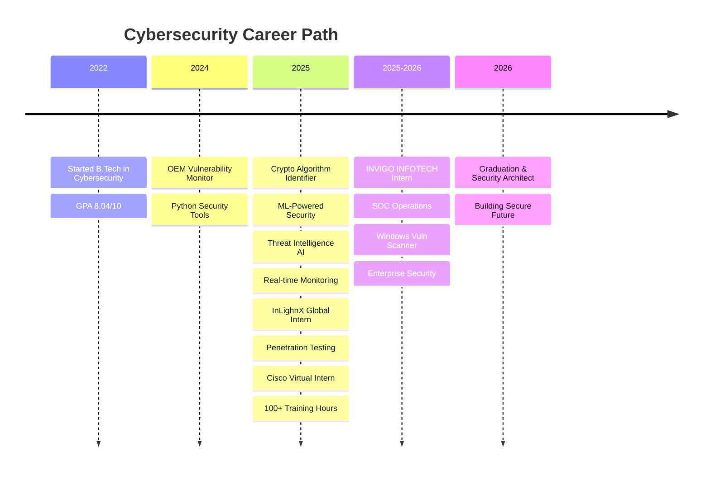

<div align="center">


</div>

<div align="center">

<!-- Typing SVG -->
<a href="https://git.io/typing-svg"></a>

</div>

<div align="center">
  
[](https://github.com/Aayush-Raj-Singh)
[](https://github.com/Aayush-Raj-Singh)
[](https://github.com/Aayush-Raj-Singh)

</div>

---


<div align="center">

## 🎯 IMPACT DASHBOARD

</div>

<table align="center">
<tr>
<td align="center" width="25%">

<h3>40+</h3>
<p>Security Vulnerabilities<br/>Identified</p>
</td>
<td align="center" width="25%">

<h3>25+</h3>
<p>Attack Vectors<br/>Validated</p>
</td>
<td align="center" width="25%">

<h3>1,000+</h3>
<p>Threat Indicators<br/>Processed Daily</p>
</td>
<td align="center" width="25%">

<h3>60-70%</h3>
<p>Efficiency<br/>Improvement</p>
</td>
</tr>
</table>


<div align="center">


## 🛠️ TECHNOLOGY ARSENAL


</div>

### 🔒 Cybersecurity & Penetration Testing

<p align="center">
  
  
  
  
  
  
  
  
  
  
</p>

<div align="center">

**Skill Mastery Levels**

</div>

```ascii
VAPT (Penetration Testing)              ████████████████████ 95%
Threat Intelligence & Analysis          ████████████████████ 95%
Network Defense & Monitoring            █████████████████░░░ 85%
SIEM & SOC Operations                   ████████████████░░░░ 80%
Incident Response & DFIR                ███████████████░░░░░ 75%
Web Application Security                ████████████████░░░░ 80%
```

### 💻 Programming & Scripting

<p align="center">
  
  
  
  
  
  
  
  
</p>

```ascii
Python (Security Automation)            ████████████████████ 95%
Bash Scripting                          █████████████████░░░ 85%
C/C++ (Low-level Security)              ████████████████░░░░ 80%
Java (Security Applications)            ███████████████░░░░░ 75%
SQL (Database Security)                 ██████████░░░░░░░░░░ 50%
```

### 🧠 AI/ML for Security

<p align="center">
  
  
  
  
  
  
  
</p>

### 🌐 Networking & Cloud Security

<p align="center">
  
  
  
  
  
  
</p>


<div align="center">

## 💼 PROFESSIONAL JOURNEY

</div>

<div align="center">



</div>

<table align="center">
<tr>
<td align="center" width="33%">

### 🎯 INVIGO INFOTECH
**SOC / VAPT Intern**<br/>
Dec 2025 - Jan 2026

✅ 15+ client systems assessed<br/>
✅ 40+ vulnerabilities identified<br/>
✅ 30% efficiency improvement

</td>
<td align="center" width="33%">

### 🎯 InLighnX Global
**Penetration Testing Intern**<br/>
Jun 2025 - Jul 2025

✅ 25+ attack vectors validated<br/>
✅ MITRE ATT&CK methodology<br/>
✅ Enterprise environment testing

</td>
<td align="center" width="33%">

### 🎯 Cisco
**Cybersecurity Intern**<br/>
Jun 2025 - Aug 2025

✅ 100+ training hours<br/>
✅ CCNA-level expertise<br/>
✅ Infrastructure hardening

</td>
</tr>
</table>


<div align="center">

### 📜 Training Programs

<table>
<tr>
<td align="center">
<br/>
<b>Cybersecurity Analyst Simulation</b>
</td>
<td align="center">
<br/>
<b>Virtual Internship Program</b>
</td>
</tr>
</table>

</div>


<div align="center">

## 📊 DETAILED ANALYTICS

</div>

<div align="center">


</div>

<div align="center">


</div>


<div align="center">

## 🤝 LET'S CONNECT & COLLABORATE


</div>

<div align="center">

<table>
<tr>
<td align="center" width="50%">

### 🔐 I'm Open For

- **SOC Analyst** Positions
- **Penetration Testing** Engagements  
- **Security Engineering** Roles
- **Threat Intelligence** Projects
- **Cybersecurity Research** Collaborations

</td>
<td align="center" width="50%">

### 🛠️ Let's Build Together

- **Open Source** Security Tools
- **Vulnerability Research** Projects
- **CTF Team** Collaborations
- **Knowledge Sharing** & Mentorship
- **Security Automation** Solutions

</td>
</tr>
</table>

</div>

<div align="center">

### 📱 Connect With Me

<a href="https://www.linkedin.com/in/aayush-raj-77a1bb237">
  
</a>
<a href="mailto:aayush.raj@myyahoo.com">
  
</a>
<a href="https://github.com/Aayush-Raj-Singh">
  
</a>
<a href="https://twitter.com/AayushR19149133">
  
</a>

<a href="https://www.instagram.com/abhayaprabha">
  
</a>
<a href="https://tryhackme.com/p/Abhayaprabha">
  
</a>
<a href="https://aayush-raj-singh.github.io/Portfolio">
  
</a>
</a>

</div>


<div align="center">
  
## 💡 SECURITY PHILOSOPHY


</div>

<div align="center">

</div>


<div align="center">

## ⭐ SUPPORT MY WORK

**If my projects help you, consider:**

[](https://github.com/Aayush-Raj-Singh)
[](https://github.com/Aayush-Raj-Singh)
[](https://github.com/Aayush-Raj-Singh)

</div>

### 🙏 Thank You For Visiting!


**Building a more secure digital future, one line of code at a time.**

</div>


