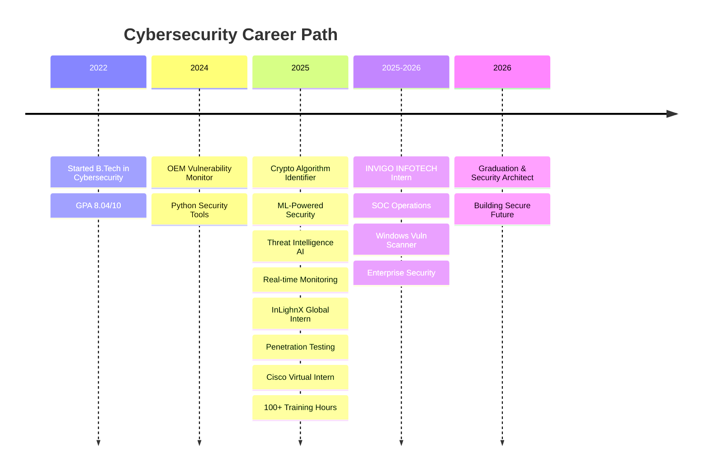

# 🛡️ Aayush Raj — Cybersecurity Engineer | Threat Hunter | Security Researcher

<div align="center">

<!-- Header -->


<!-- Typing Animation -->
<a href="https://git.io/typing-svg">
  
</a>

<!-- Social Stats -->
<br/>
<a href="https://github.com/Aayush-Raj-Singh">
  
  
  
</a>

</div>

---

## 🎯 About Me

B.Tech Cybersecurity graduate from Government Engineering College West Champaran with **8.04/10 GPA**. Specializing in penetration testing, threat intelligence, and SOC operations. Proven track record across enterprise security with hands-on experience in vulnerability assessment, incident response, and security automation.

---

## 🛠️ Technology Arsenal

### 🔒 Cybersecurity & Penetration Testing
```
Kali Linux  •  Metasploit  •  Burp Suite  •  Wireshark  •  Nmap  
OWASP  •  MITRE ATT&CK  •  John the Ripper  •  Hydra  •  SQLmap
```

### 💻 Programming & Scripting
```
Python  •  C  •  C++  •  Java  •  JavaScript  •  Bash  •  PowerShell  •  SQL
```

### 🧠 AI/ML for Security
```
TensorFlow  •  scikit-learn  •  Pandas  •  NumPy  •  LangChain  •  OpenAI  •  Hugging Face
```

### 🌐 Networking & Cloud Security
```
Cisco  •  AWS  •  Azure  •  Docker  •  Kubernetes  •  Linux  •  Ubuntu
```

---

## 💼 Professional Experience

<table align="center">
<tr>
<td align="left" width="33%">

### 🏢 INVIGO INFOTECH
**SOC / VAPT Intern**  
📅 Dec 2025 - Jan 2026

- ✅ **15+** client systems assessed
- ✅ **40+** vulnerabilities identified  
- ✅ **30%** efficiency improvement in reporting

</td>
<td align="left" width="33%">

### 🏢 InLighnX Global
**Penetration Testing Intern**  
📅 Jun 2025 - Jul 2025

- ✅ **25+** attack vectors validated
- ✅ MITRE ATT&CK methodology applied
- ✅ Enterprise environment testing

</td>
<td align="left" width="33%">

### 🏢 Cisco
**Cybersecurity Virtual Intern**  
📅 Jun 2025 - Aug 2025

- ✅ **100+** training hours completed
- ✅ CCNA-level infrastructure expertise
- ✅ Network hardening principles

</td>
</tr>
</table>

### 📊 Career Progression


```mermaid
timeline
    title Cybersecurity Career Path
    2022 : Started B.Tech in Cybersecurity : GPA 8.04/10
    2024 : OEM Vulnerability Monitor : Python Security Tools
    2025 : Crypto Algorithm Identifier : ML-Powered Security
         : Threat Intelligence AI : Real-time Monitoring
         : InLighnX Global Intern : Penetration Testing
         : Cisco Virtual Intern : 100+ Training Hours
    2025-2026 : INVIGO INFOTECH Intern : SOC Operations
              : Windows Vuln Scanner : Enterprise Security
    2026 : Graduation & Security Architect : Building Secure Future
```

---

## 🏅 Certifications & Badges

### Cisco Certifications
<div align="center">

| | | | | | | |
|:-:|:-:|:-:|:-:|:-:|:-:|:-:|
|  |  |  |  |  |  |  |
| Python Essentials 1 | Python Essentials 2 | Ethical Hacker | CCNA: ITN | CCNA: SRWE | CCNA: ENSA | Hardware Basics |

</div>

### TryHackMe Achievements
<div align="center">

| | | | | | |
|:-:|:-:|:-:|:-:|:-:|:-:|
|  |  |  |  |  |  |
| OWASP Top 10 | Webbed | Advent of Cyber 5 | Linux | Security Awareness | How the Web Works |

</div>

### Salesforce Trailhead Ranks
<div align="center">

| | | | | | |
|:-:|:-:|:-:|:-:|:-:|:-:|
|  |  |  |  |  |  |
| Scout | Hiker | Explorer | Adventurer | Mountaineer | Expeditioner |

</div>

### Training Programs
- **Tata Group** — Cybersecurity Analyst Simulation
- **Cisco** — Virtual Internship Program

---

## 📊 GitHub Analytics

<div align="center">


<br/>


</div>

---

## 🤝 Let's Connect & Collaborate

### 🔓 I'm Open For
- **SOC Analyst** Positions
- **Penetration Testing** Engagements
- **Security Engineering** Roles
- **Threat Intelligence** Projects
- **Cybersecurity Research** Collaborations

### 🛠️ Let's Build Together
- **Open Source** Security Tools
- **Vulnerability Research** Projects
- **CTF Team** Collaborations
- **Knowledge Sharing** & Mentorship
- **Security Automation** Solutions

---

## 📱 Contact & Social

<div align="center">

[](https://www.linkedin.com/in/aayush-raj-77a1bb237)
[](mailto:aayush.raj@myyahoo.com)
[](https://github.com/Aayush-Raj-Singh)
[](https://twitter.com/AayushR19149133)
[](https://www.instagram.com/abhayaprabha)
[](https://tryhackme.com/p/Abhayaprabha)
[](https://aayush-raj-singh.github.io/Portfolio)

</div>

---

## 💡 Security Philosophy

<div align="center">


<br/>

**Building a more secure digital future, one line of code at a time.**

</div>

---

## ⭐ Show Your Support

If my projects help you, please consider:

<div align="center">

[](https://github.com/Aayush-Raj-Singh)
[](https://github.com/Aayush-Raj-Singh)
[](https://github.com/Aayush-Raj-Singh)

</div>

---

<div align="center">


### 🙏 Thank You For Visiting!

</div>
